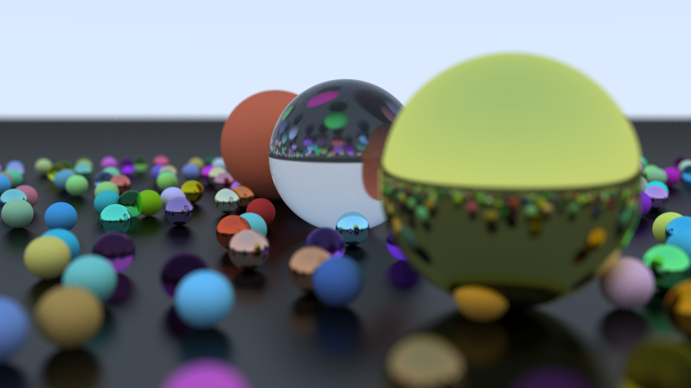

# RayTraceWKND
A simple raytracer based on RayTracing in One Weekend.
## Release Notes
### 1.0:
- Multithreaded
- Spheres/Planes Supported
- Dielectric, Lambertian, and Specular materials supported.
- DOF, FOV, and Camera movement supported.
- Width, Height, Samples, and Max ray depth settings.
- BMP image output.
- Fresnel reflection supported.
- MSAA